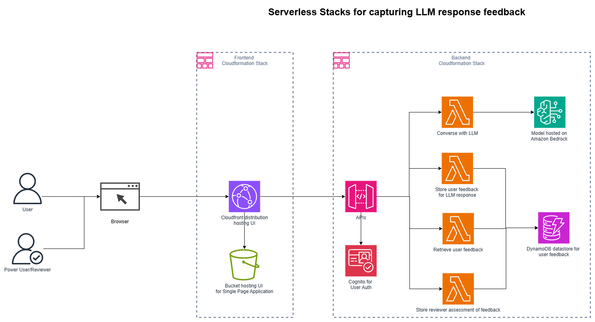
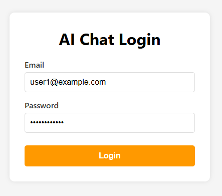
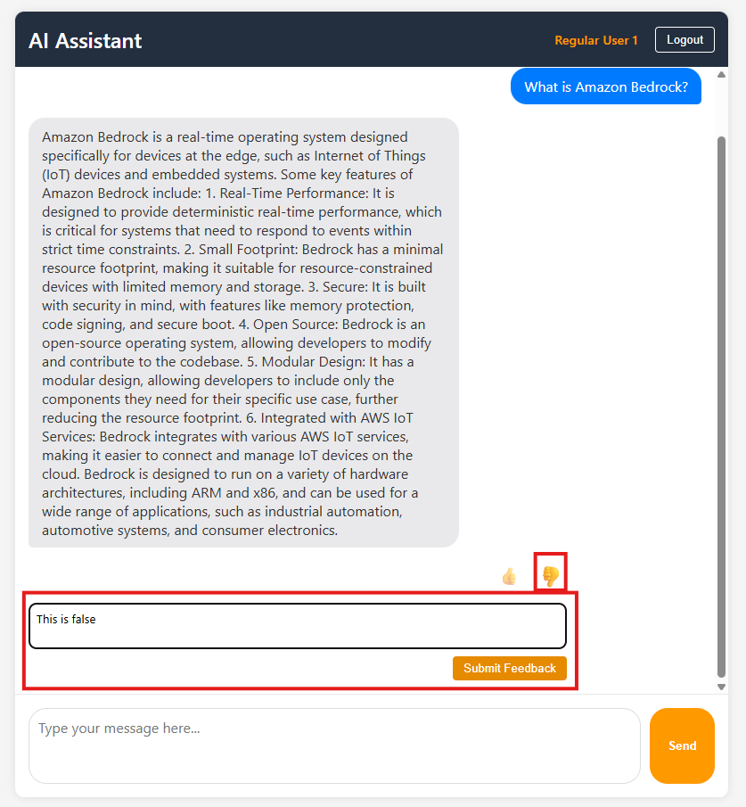
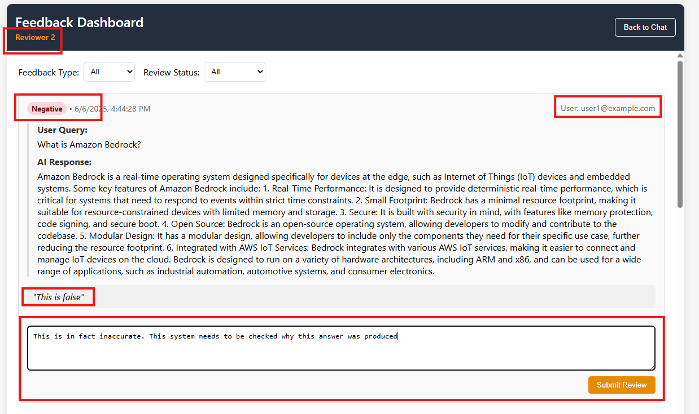

# RAG Feedback System

A sample serverless solution for AI chat applications with integrated user feedback capabilities, built on AWS.

## Overview

This project demonstrates how to implement user feedback integration in AI chat applications. It consists of two main stacks:

1. **Backend Stack**: APIs and services that power the LLM model interactions and handle user feedback for the responses generated by the LLM (capture and retrieval)
2. **Frontend Stack**: Single Page Application (SPA) with a user interface that integrates with the backend APIs

The system includes user authentication via Amazon Cognito, with different permission levels. Power users (reviewers) can review feedback submitted by regular users, add comments, and mark items as reviewed.

## Architecture



### Backend Components

- **AWS Lambda Functions**:
  - `feedback-lambda`: Processes conversation requests with Claude AI
  - `feedback-writer-lambda`: Stores user feedback in DynamoDB
  - `feedback-reader-lambda`: Retrieves feedback data for analysis
  - `feedback-reviewer-lambda`: Allows reviewers to add comments to feedback
  
- **Amazon Bedrock**: Uses Claude model to generate responses via the Converse API
  
- **Amazon Cognito**: Manages user authentication and authorization
  - Regular users: Can submit feedback
  - Reviewer users: Can review and comment on feedback
  
- **Amazon API Gateway**: Provides HTTP endpoints with Cognito authorization:
  - `/conversation`: For AI conversations
  - `/submit-feedback`: For submitting user feedback
  - `/feedback-data`: For retrieving feedback data
  - `/review-feedback`: For reviewers to add comments to feedback
  
- **Amazon DynamoDB**: Stores user feedback with conversation context and user information

### Frontend Components

- **Single Page Application (SPA)**:
  - User authentication with Cognito
  - Clean, modern chat interface
  - User identification display
  - Thumbs up/down feedback buttons
  - Text feedback form
  - Reviewer dashboard for power users
  
- **Amazon S3 & CloudFront**: Hosts and delivers the SPA

## Features

- **AI Conversations**: Interact with Claude AI through a simple chat interface
- **User Authentication**: Secure login with different permission levels
- **User Identification**: Display user name in the interface
- **User Feedback Collection**: 
  - Capture positive/negative feedback with optional text comments
  - Store feedback with conversation context for analysis
- **Feedback Analysis**: Query and analyze feedback data by conversation or type
- **Feedback Review System**: Allow power users to review and comment on feedback
- **CORS Support**: Properly configured for cross-origin requests
- **Comprehensive Logging**: Detailed logs for troubleshooting

## Project Structure

```
rag-feedback/
├── backend/                # Backend components
│   ├── cloudformation/     # CloudFormation templates
│   │   └── template.yaml   # Main backend stack template
│   └── src/                # Lambda function source code
│       ├── app.py          # Conversation Lambda
│       ├── feedback_writer.py # Feedback submission Lambda
│       ├── feedback_reader.py # Feedback retrieval Lambda
│       ├── feedback_reviewer.py # Feedback reviewer Lambda
│       └── requirements.txt # Python dependencies
├── frontend/               # Frontend components
│   ├── cloudformation/     # Frontend infrastructure
│   │   └── spa-template.yaml # CloudFront/S3 template
│   └── public/             # SPA static files
│       ├── index.html      # Router page
│       ├── login.html      # Login page
│       ├── chat.html       # Main chat interface
│       ├── feedback.html   # Feedback dashboard
│       ├── styles.css      # CSS styling
│       ├── app.js          # Main application JavaScript
│       ├── auth.js         # Authentication JavaScript
│       ├── feedback.js     # Feedback dashboard JavaScript
│       └── config.js       # Configuration file
├── scripts/                # Deployment and utility scripts
│   ├── deploy.ps1          # Backend deployment script
│   ├── update-lambda.ps1   # Script to update Lambda code
│   ├── deploy-frontend.ps1 # Frontend deployment script
│   ├── update-frontend-config.ps1 # Update frontend config with backend endpoints
│   ├── update_frontend_config.py  # Python script for updating frontend config
│   ├── update-frontend-config.sh  # Bash script for updating frontend config
│   ├── create_users.py     # Python script to create Cognito users
│   ├── create_users.sh     # Bash script to run create_users.py
│   ├── create_users.ps1    # PowerShell script to run create_users.py
│   └── sample_users.json   # Sample user data for create_users.py
└── images/                 # Screenshots and UI images
```

## Deployment

### Backend Deployment

For Windows:
```powershell
cd scripts
.\deploy-backend.ps1
```

For Linux/macOS:
```bash
cd scripts
./deploy-backend.sh
```

This will deploy the backend stack named `ai-chat-backend-stack`.

To update Lambda functions without redeploying the entire stack:

For Windows:
```powershell
cd scripts
.\update-lambda.ps1
```

For Linux/macOS:
```bash
cd scripts
./update-lambda.sh
```

### Creating Users

After deploying the backend stack, you can create users with the provided script:

```powershell
cd scripts
.\create_users.ps1
```

For Linux/macOS:

```bash
cd scripts
./create_users.sh
```

The first time you run this script, it will create a `sample_users.json` file from the template. You'll need to edit this file to set real passwords before running the script again.

This will create sample users with different permission levels:
- Regular users: user1@example.com, user2@example.com, user3@example.com
- Reviewer users: reviewer1@example.com, reviewer2@example.com

Note: The `sample_users.json` file is excluded from Git to prevent credentials from being stored in the repository.

### Frontend Deployment

For Windows:
```powershell
cd scripts
.\deploy-frontend.ps1
```

For Linux/macOS:
```bash
cd scripts
./deploy-frontend.sh
```

This will deploy the frontend stack named `feedback-frontend-stack`.

After deploying the frontend, update the configuration with the backend endpoints:

For Windows:
```powershell
cd scripts
.\update-frontend-config.ps1
```

For Linux/macOS:
```bash
cd scripts
./update-frontend-config.sh
```

## Cleanup

### Cleanup Backend Resources

```powershell
cd scripts
.\cleanup-backend.ps1
```

For Linux/macOS:

```bash
cd scripts
./cleanup-backend.sh
```

### Cleanup Frontend Resources

```powershell
cd scripts
.\cleanup-frontend.ps1
```

For Linux/macOS:

```bash
cd scripts
./cleanup-frontend.sh
```

### Cleanup All Resources

```powershell
cd scripts
.\cleanup-all.ps1
```

For Linux/macOS:

```bash
cd scripts
./cleanup-all.sh
```

## API Endpoints

### Conversation API

```
POST /conversation
{
  "message": "Your message here"
}
```

### Feedback Submission API

```
POST /submit-feedback
{
  "conversation_id": "uuid",
  "feedback_type": "positive|negative|neutral",
  "feedback_text": "Optional feedback text",
  "original_query": "User's original question",
  "llm_response": "AI's response"
}
```

### Feedback Retrieval API

```
GET /feedback-data
GET /feedback-data?conversation_id=uuid
GET /feedback-data?feedback_type=positive
```

### Feedback Review API

```
POST /review-feedback
{
  "feedback_id": "uuid",
  "reviewer_comments": "Comments from reviewer"
}
```

## Authentication Flow

1. Users visit the application and are redirected to the login page
2. After successful login through Cognito authentication, a JWT token is stored in the browser's localStorage
3. The token is sent with each API request in the Authorization header
4. API Gateway validates the token using Cognito authorizers
5. Lambda functions extract user information from the token
6. User permissions determine available features and data access

## Data Model

### Feedback Item

```json
{
  "id": "uuid",
  "conversation_id": "uuid",
  "feedback_type": "positive|negative|neutral",
  "feedback_text": "User feedback text",
  "original_query": "User's question",
  "llm_response": "AI's response",
  "timestamp": "ISO datetime",
  "user_id": "user's email or ID",
  "reviewed": false,
  "reviewer_comments": "Comments from reviewer",
  "reviewer_id": "reviewer's email or ID"
}
```

## Use Cases

- **Customer Support**: Enhance AI-powered support systems with user satisfaction tracking
- **Content Generation**: Improve AI content creation by analyzing user feedback
- **Knowledge Base Systems**: Refine RAG (Retrieval-Augmented Generation) systems based on user feedback
- **Product Development**: Gather insights on AI feature performance and user satisfaction
- **Quality Assurance**: Enable reviewers to validate and improve AI responses based on user feedback

## Benefits

- **Continuous Improvement**: Use feedback data to fine-tune AI models and improve responses
- **User Experience**: Create more responsive and user-centered AI applications
- **Performance Metrics**: Track AI system performance through quantifiable feedback data
- **Quality Control**: Implement a review process for AI-generated content
- **User Management**: Control access to feedback data with different permission levels

## Screenshots

### Login Page


### User providing feedback


### Power user reviewing feedback provided by users
